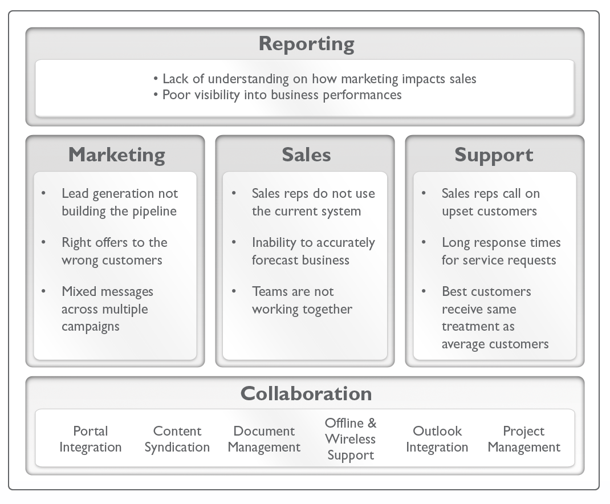
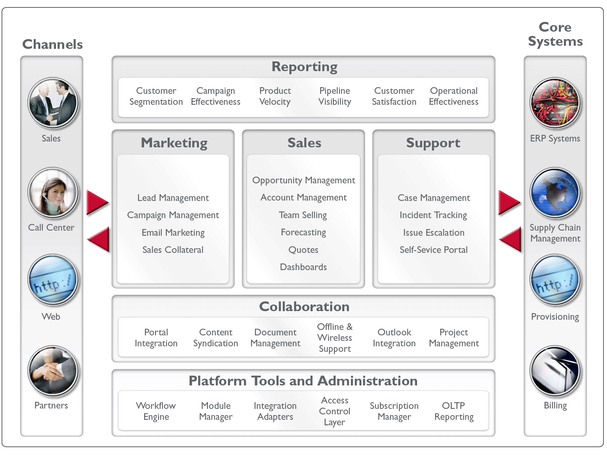
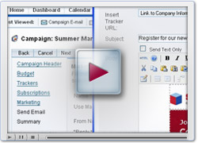
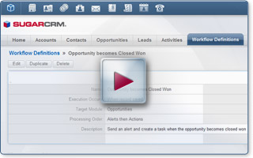
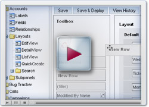

              

  <pre class="script">template("MindTouch/IDF/Views/TableOfContents");</pre>
  <h2>Overview</h2>
  
Understanding Customer Relationship Management will help you get the most from your Sugar implementation.

  
Customer Relationship Management (CRM) is a set of technology-enabled business processes that enable you to create more consistent and profitable interactions with your customers.

  <h2>CRM Defined</h2>
  
Most companies engage in some form of customer relationship management. When a company builds a customer list, assigns opportunities to sales representatives, or handles customer support cases, they are undertaking CRM-related activities.

  
CRM applications standardize, automate, and share these activities across organizations to improve how companies interact with their customers.

  <h2>Pre-CRM Practices</h2>
  
Before adopting a CRM application, companies should understand how they interact with customers in order to understand the benefits they can derive from CRM applications.

  
Some questions to ask are:

  <ul>
    <li>How do I segment prospects and present them with compelling marketing offers?</li>
    <li>Does my sales force effectively manage opportunities and coordinate their sales process across individuals and teams?</li>
    <li>How does my support organization handle customer issues?</li>
    <li>Are my employees communicating effectively across teams and departments?</li>
    <li>Does my management team have the insight across marketing, sales, and service to make the correct decisions?</li>
  </ul>
  <h2>Challenges with Customer Interactions</h2>
  
The graphic below illustrates some challenges companies face in key functional areas.

  

    
  

  <h2>Improving Customer Facing Interaction</h2>
  
CRM applications allow companies to improve customer-facing interactions across various channels; including sales, partner channels, the Web, and call centers.

  
To accomplish this, CRM systems often tie into other core systems that help to run the business including accounting, order management, enterprise resource planning (ERP), manufacturing, provisioning and supply chain management systems.

  
The graphic below shows how CRM can manage important customer-facing functions across channels and systems.

  

    
  

  <h2>Automating Customer Facing Processes</h2>
  
CRM applications automate certain customer-facing processes and provide solutions around key functional areas to enable companies to interact with customers in a more consistent, structured approach.&nbsp; The solutions are described in the table below.

  <table border="1" cellpadding="0" cellspacing="0" style="width: 540px;" width="506">
    <tbody>
      <tr>
        <td style="width: 138px;">
          <strong>Functional Area</strong>
        </td>
        <td style="width: 398px;">
          <strong>Description</strong>
        </td>
      </tr>
      <tr>
        <td>
          
Sales Force Automation (SFA)

        </td>
        <td style="width: 398px;">
          
Improves sales performance by allowing sales representatives to track and share opportunities, manage and up-sell into existing accounts, coordinate activities across teams, monitor pipeline stages through dashboards, and work offline with mobile solutions.

        </td>
      </tr>
      <tr>
        <td>
           
          
Customer Support

        </td>
        <td style="width: 398px;">
          
Improves customer relationships by helping support representatives track customer cases, manage product problems, respond to customer inquiries, and share customer service information across the entire organization.

        </td>
      </tr>
      <tr>
        <td>
          
Marketing Automation

        </td>
        <td style="width: 398px;">
          
Allows companies to develop, launch, and track campaigns and other marketing offers to customers. Marketing automation integrates closely with Sales Force Automation to ensure leads are effectively passed between marketing and sales departments.

        </td>
      </tr>
      <tr>
        <td>
          
Collaboration

        </td>
        <td>
          
Improves employee communications by integrating calendars, shared tasks, documents, product information, contracts and other customer materials in a single location and making them accessible to employees in various departments.

        </td>
      </tr>
      <tr>
        <td>
          
Reporting

        </td>
        <td style="width: 398px;">
          
Reporting tools capture the activities and business results of different lines of business and presents them to management in a readily understandable set of charts and reports.&nbsp; This provides company leaders with the information they need to make intelligent decisions.

        </td>
      </tr>
    </tbody>
  </table>
  <h2>CRM Strategy</h2>
  
CRM applications are an integral piece of the overall customer experience.&nbsp; These systems work best when a clear CRM strategy is in place.&nbsp; Building a true customer-centric organization requires companies to:

  <ul>
    <li>Establish measurable business goals.</li>
    <li>Align business and IT organizations.</li>
    <li>Build executive sponsorship.</li>
    <li>Allow business goals to dictate CRM customizations.</li>
    <li>Solicit end users in product customizations.</li>
    <li>Invest in training for end users.</li>
    <li>Measure, monitor, and track results.</li>
  </ul>
  
A CRM application should be part of a company’s overall business strategy.&nbsp; Business alignment is key to user adoption and business success.

  <h2>Basic CRM Demos</h2>
  

    
  

  

    <strong>
      
    </strong>
    <a class="external" href="http://www.sugarcrm.com/demo/sales-force-automation-demo" title="http://www.sugarcrm.com/demo/sales-force-automation-demo">Sales Force Automation Demo</a>
  

  

  

    <a class="external" href="http://www.sugarcrm.com/demos" title="http://www.sugarcrm.com/demos">
      More demos on using CRM in your organization
      
    </a>
  

  <h2>Advanced CRM Demos</h2>
  
SugarCRM is designed to manage sales, marketing and support teams of all sizes. Role management tools enable you to create complex user roles and set limits on what data users can see, and which data they can manipulate in the system. Find resources to help you use Sugar’s granular data and user management capabilities to allow you to create and manage your different teams and business processes.

  <h3>Creating Effective Workflows</h3>
  

    
  

  

    
    <a title="03_Training/02_Videos/07_Creating_Effective_Workflows_in_Sugar" href="//03_Training/02_Videos/07_Creating_Effective_Workflows_in_Sugar">Creating Effective Workflows</a>
  

  <h3>Configuration Tools</h3>
  

    
  

  

    <a class="external" href="http://www.sugarcrm.com/demo/administration-demo" title="http://www.sugarcrm.com/demo/administration-demo">
      How to Configure Sugar
      
    </a>
  

  <h2>Related</h2>
  <pre class="script">template("MindTouch/IDF/SeeAlso")</pre>
   

             