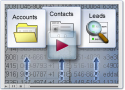

              

  
The following script renders the table of contents for this page.

  <h2>Overview</h2>
  
Track your customer data, access the latest marketing collateral or build a quote from the product catalog. Keep management happy with clear insight into the sales pipeline. Build next quarter’s forecast based on historical performance. Do all this, and more, with the Sugar sales modules.

  <h3>Import Leads &amp; Other Data</h3>
  

    
  

  

    <a title="03_Training/02_Videos/12_Importing_Data" href="//03_Training/02_Videos/12_Importing_Data">
      How to Import Data Into Sugar
      
    </a>
  

  

    Additional Resources:
  

  

    
    <a title="Importing Made Easy" href="//04_Find_Answers/02KB/01Getting_Started/Introduction_to_Importing">5 Easy Steps to Importing</a>
  

  

    
    <a title="Import Data v6.4" href="//02_Documentation/01_Sugar_Editions/04_Sugar_Professional/Sugar_Professional_6.4/Sugar_Professional_Application_Guide_6.4.0/52_Import">Tutorial: How Do I Import Data?</a>
  

  

    
    <a title="Import" href="//02_Documentation/01_Sugar_Editions/04_Sugar_Professional/Sugar_Professional_6.4/Sugar_Professional_Application_Guide_6.4.0/52_Import">Documentation: User Guide</a>
  

  <h3>Creating and Managing Users</h3>
  

    
  

  

    <a title="03_Training/02_Videos/09_Creating_Users%2C_Teams_and_Roles_in_Sugar" href="//03_Training/02_Videos/09_Creating_Users_Teams_and_Roles_in_Sugar">
      How to Create and Manage Users
      
    </a>
  

  

    Additional Resources:
  

  

    
    <a title="03_Training/01_How_Do_I/90_Administer_and_Configure_Sugar/Manage_Users_v6.4" href="//03_Training/01_How_Do_I/90_Administer_and_Configure_Sugar/Manage_Users_v6.4">Tutorial: How Do I Manage Users?</a>
  

  

    
    <a title="Sugar Professional 6.4.0 Administration Guide" href="//02_Documentation/01_Sugar_Editions/04_Sugar_Professional/Sugar_Professional_6.4/Sugar_Professional_Administration_Guide_6.4.0">Documentation: Admin Guide</a>
  

  <h3>Set Up Email in Sugar</h3>
  

    
  

  

    <a title="03_Training/02_Videos/10_Configuring_Email_Settings" href="//03_Training/02_Videos/10_Configuring_Email_Settings">
      How to Set Up Email in Sugar
      
    </a>
  

  

    Additional Resources:
  

  

    <a title="04_Find_Answers/02KB/01Getting_Started/An_Introduction_to_Email_Functionality_in_Sugar" href="//04_Find_Answers/02KB/01Getting_Started/Introduction_to_Email_Functionality_in_Sugar">
      An Introduction to Email Functionality
      
    </a>
  

  

    
    <a title="Configure General Email Settings" href="//02_Documentation/01_Sugar_Editions/04_Sugar_Professional/Sugar_Professional_6.4/Sugar_Professional_Administration_Guide_6.4.0/06_Email">Admin Guide: Configure Email Settings</a>
  

  

    <a title="02_Documentation/01_Sugar_Editions/04_Sugar_Professional/Sugar_Professional_6.4/Sugar_Professional_6.4.0_Application_Guide/23_Emails" href="//02_Documentation/01_Sugar_Editions/04_Sugar_Professional/Sugar_Professional_6.4/Sugar_Professional_Application_Guide_6.4.0/23_Emails">
      User Guide: Set Up the Email Client
      
    </a>
  

  <h3>Use Sugar With Outlook</h3>
  

    
  

  

    <a title="03_Training/02_Videos/06_SugarCRM_Plug-in_for_Microsoft_Outlook" href="//03_Training/02_Videos/06_SugarCRM_Plug-in_for_Microsoft_Outlook">
      How to Set Up and Use Sugar Plug-Ins
      
    </a>
  

  

    Additional Resources:
  

  

    <a title="04_Find_Answers/02KB/01Getting_Started/How_to_Download_and_Install_Sugar_Plug-Ins" href="//04_Find_Answers/02KB/01Getting_Started/Downloading_and_Installing_Sugar_Plug-ins">
      How to Download and Install Sugar Plug-Ins
      
    </a>
  

  <h3>Reporting</h3>
  

    Sugar Reporting turns data into actionable information. Managers can monitor business performance across the entire business with reporting tools on marketing analytics, sales trends, case reports, and customer profiles. Dashboards can be configured to meet the individual roles of users or to track key metrics across the organization. Reporting is only included in the
    <a class="external" href="http://www.sugarcrm.com/product/sugar-professional" title="http://www.sugarcrm.com/product/sugar-professional">Sugar Professional</a>
    ,
    <a class="external" href="http://www.sugarcrm.com/product/sugar-corporate" title="http://www.sugarcrm.com/product/sugar-corporate">Sugar Corporate</a>
    ,
    <a class="external" href="http://www.sugarcrm.com/product/sugar-enterprise" title="http://www.sugarcrm.com/product/sugar-enterprise">Sugar Enterprise</a>
    and
    <a class="external" href="http://www.sugarcrm.com/product/sugar-ultimate" title="http://www.sugarcrm.com/product/sugar-ultimate">Sugar Ultimate</a>
    subscriptions.
  

  

    
  

  

    <a class="external" href="http://www.sugarcrm.com/webcast/report-building-sugarcrm-webinar" title="http://www.sugarcrm.com/webcast/report-building-sugarcrm-webinar">
      Sugar Reports in Action
      
    </a>
  

  

    
  

  

    <a title="03_Training/02_Videos/03_Creating_Reports" href="//03_Training/02_Videos/03_Creating_Reports">
      How to Create Your Own Reports
      
    </a>
  

  <h2>Related</h2>
  
This section automatically lists related pages, such as child pages or pages related by tags. Remove this section if you do not want to show related pages.

  <pre class="script">template("MindTouch/IDF/SeeAlso")</pre>
   

             