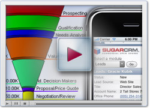

  
The following script renders the table of contents for this page.

  <h2>Overview</h2>
  
Most companies engage in some form of customer relationship management. When a company builds a customer list, assigns opportunities to sales representatives, or handles customer support cases, it is undertaking CRM-related activities.

  
CRM applications standardize, automate, and share these activities across organizations to improve how companies interact with their customers.

  <h3>Learn More</h3>
  

    
  

  

    <a title="03_Training/01_How_Do_I/000_Learn_the_Sugar_Basics/02_Understand_Customer_Relationship_Management_(CRM)" href="//01_Get_Started/01_End_Users/01_Free_Trial/02_Introduction_to_CRM">
      About Customer Relationship Management
      
    </a>
  

  

    <a class="external" href="http://www.sugarcrm.com/demos" title="http://www.sugarcrm.com/demos">
      More demos on using CRM in your organization
      
    </a>
  

  

  

  

  

  

    <strong>
      <a class="external" href="http://www.sugarcrm.com/demo/sales-force-automation-demo" title="http://www.sugarcrm.com/demo/sales-force-automation-demo">
        Sales Force Automation Demo
        
      </a>
    </strong>
  

  <h2>Related</h2>
  
This section automatically lists related pages, such as child pages or pages related by tags. Remove this section if you do not want to show related pages.

  <pre class="script">template("MindTouch/IDF/SeeAlso")</pre>
   

