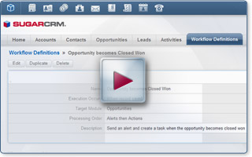
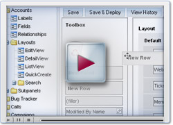

  
The following script renders the table of contents for this page.

  <h2>Overview</h2>
  
SugarCRM is designed to manage sales, marketing and support teams of all sizes. Role management tools enable you to create complex user roles and set limits on what data users can see, and which data they can manipulate in the system. Find resources to help you use Sugar’s granular data and user management capabilities to allow you to create and manage your different teams and business processes.

  <h3>Creating Effective Workflows</h3>
  

    
  

  

    
    <a title="03_Training/02_Videos/07_Creating_Effective_Workflows_in_Sugar" href="//03_Training/02_Videos/07_Creating_Effective_Workflows_in_Sugar">Creating Effective Workflows</a>
  

  <h3>Configuration Tools</h3>
  

    
  

  

    <a class="external" href="http://www.sugarcrm.com/demo/administration-demo" title="http://www.sugarcrm.com/demo/administration-demo">
      How to Configure Sugar
      
    </a>
  

  

    Additional Resources:
  

  

    <a title="03_Training/01_How_Do_I/90_Administer_and_Configure_Sugar" href="//03_Training/01_How_Do_I/90_Administer_and_Configure_Sugar">
      Browse online training on configuration tools
      
    </a>
  

  <h2>Related</h2>
  
This section automatically lists related pages, such as child pages or pages related by tags. Remove this section if you do not want to show related pages.

  <pre class="script">template("MindTouch/IDF/SeeAlso")</pre>
   

